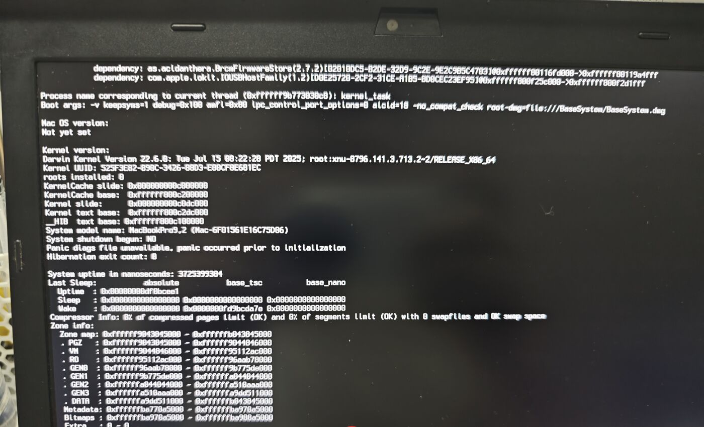

# 踩坑记录

这里每一条都是真机上撞过的。按「现象 → 根因 → 修法」写。
如果你正卡在某个地方,先在这儿搜现象关键词。

---

## 1. CSM 开着,进不去安装器

**现象**:OpenCore 能引导,进度条走到大约一半就停住,不报错、不动。

**根因**:X230 的 CSM(Compatibility Support Module)开着时,UEFI 运行环境是半吊子的,
macOS 安装器起不来。

**修法**:BIOS 里 `Startup → UEFI/Legacy Boot = UEFI Only`、`CSM Support = No`。

> 注:CSM 关掉之后,老 Windows 之类的 Legacy 系统会启动不了。多系统机器注意。

---

## 2. `_LID → XLID` 重命名让 DSDT 的 `VID._INI` 崩

**现象**:引导时刷出

```
ACPI Error: Method parse/execution failed \_SB.PCI0.VID._INI, AE_NOT_FOUND
```

随后可能冻屏。

**根因**:早期用 [RapidEFI](https://github.com/JeoJay127/RapidEFI-Tool) 生成的 config 里有一条 `_LID\x00 → XLID\x00` 的全表重命名。
X230 的 DSDT 里:

```asl
Device (VID) {                                        // _SB.PCI0.VID,显卡
    Method (_INI, 0) { CLID = \_SB.LID._LID () }      // 引用了 LID._LID
}
```

重命名把 `_LID` 的**定义**改成了 `XLID`(而且是 Count=0 的全表替换),
但这个**引用**没跟着改,于是引用悬空 → `AE_NOT_FOUND`。

**修法**:删掉这条重命名,同时删掉依赖它的 `SSDT-LID.aml`。
`_LID` 走原厂实现即可——那个「合盖伪装」本来就是个可选 hack。

> 教训:OpenCore 的 `ACPI/Patch` 作用于**所有固件表**,包括 DSDT。
> 做任何重命名前,先想清楚「还有谁在引用这个名字」。

---

## 3. 蓝牙 kext 在安装器环境下 kernel panic

**现象**:引导**安装器**(BaseSystem)时 panic,栈里能看到:

```
dependency: as.acidanthera.BrcmFirmwareStore(2.7.2)
dependency: com.apple.iokit.IOUSBHostFamily(1.2)
```



> 实拍。同一屏上还能看到 `root-dmg=file:///BaseSystem/BaseSystem.dmg`(正在引导**安装器**)、
> 以及 `System model name: MacBookPro9,2`。注意 `Mac OS version: Not yet set` ——
> 系统还没起来,所以这时候任何 kext 的依赖没满足,都会直接崩在这一步。

**根因**:`as.acidanthera.BrcmFirmwareStore` 就是 `BrcmFirmwareData.kext`,
它是 `BrcmPatchRAM3.kext` 的依赖。这个驱动会去匹配 USB 蓝牙设备并灌固件,
而安装器环境下 USB 栈还没成型 → 崩。

**修法**:装系统阶段关掉蓝牙这一组,装完再开(**真正会崩的是上面那三个 Brcm**,
`BlueToolFixup` 是 12+ 才用的,一并关掉只是为了安装期清单更干净):

```
BrcmBluetoothInjector.kext   ← 关
BrcmFirmwareData.kext        ← 关
BrcmPatchRAM3.kext           ← 关
BlueToolFixup.kext           ← 关
```

本仓库用两份 config 区分:[`../EFI/OC/config-install.plist`](../EFI/OC/config-install.plist)(装系统)
和 [`../EFI/OC/config.plist`](../EFI/OC/config.plist)(日常)。

> [`banhbaoxamlan/X230-Hackintosh`](https://github.com/banhbaoxamlan/X230-Hackintosh)
> 也是这么分的,它的 Install USB 版连自定义 ACPI 都不加载。
> **装系统时的第一原则:变数越少越好。**

---

## 4. `EHC1`/`EHC2` 必须先改名成 `EH01`/`EH02`,否则内建 USB 设备全看不见

**现象**:蓝牙、摄像头、指纹一个都看不到。插在左侧 USB3 口上的 U 盘倒是正常,
所以很容易误判成「USB 没配好」而去折腾端口地图——方向就错了。

**根因**:这三个设备不是插在根集线器上,而是挂在 **EHC2 的内置 hub**(`URTH`→`URMH`)后面。
而 macOS 的 `AppleUSBEHCIPCI` 只认 **`EH01` / `EH02`** 这两个名字,
X230 原厂 DSDT 里它们叫 `EHC1` / `EHC2` → **两个 EHCI 控制器压根不会被驱动**,
hub 后面的设备自然一个都不出现。地图也救不了:`provider` 不存在,注入无处可去。

顺带一个旁证:本机那份实测端口地图(`USBPorts.kext`)里的 EHCI personality,
匹配名同样只能是 `EH01` / `EH02`:

```
MacBookPro9,2-EH01 / MacBookPro9,2-EH02    IONameMatch: EH01 / EH02
                                           IOProviderClass: AppleUSBEHCIPCI
```

**修法**:ACPI/Patch 加两条**全表**重命名(本仓库已加):

```
EHC1 → EH01
EHC2 → EH02
```

`Count` 必须是 **0**(替换全部出现)。DSDT 里 `\_SB.PCI0.EHC1.RID` 这种引用出现得比
`Device (EHC1)` 的定义还早,`Count = 1` 只会把引用改掉、定义留着 → 就是第 2 条那个 `AE_NOT_FOUND`。

> 改名是原子的:定义、所有 `Scope`/`Notify` 路径、`_EJD` 里的字符串一起换,
> 少换一处就断链。改完拿自己的 DSDT 过一遍字节替换再反编译,确认没有残留。

**还要有人声明端口**:改名只是让 `AppleUSBEHCIPCI` 认下这两个控制器,
**内置 hub 上的端口还得声明出来**。本仓库用 `USBInjectAll.kext` 0.7.8,它自带:

```
EH01 / EH02                IOProviderClass = AppleUSBEHCIPCI     → PR11…PR18 / PR21…PR26
HUB1 / HUB2                IOProviderClass = AppleUSB20InternalHub  → HP11…HP18 / HP21…HP28
                           (按 locationID 绑:0x1D100000 = EHC1、0x1A100000 = EHC2)
8086_1e31 的 XHCI 端口表                                            → HS01…HS04 + SS01…SS04
```

> ⚠️ **自己做的地图在本机行不通**(2026-09-27):换成 Hackintool 实测导出的
> `USBPorts.kext` 后,EHC2 内置 hub 后面的蓝牙 / 摄像头 / 指纹**全部消失**;
> 换回 `USBInjectAll` 立刻恢复。原因未定(嫌疑:漏声明 `HP21`;
> `portType` 与 `UsbConnector` 键名混用)。详见 [`USB定制.md`](USB定制.md) 第 6 节。

详见 [`USB定制.md`](USB定制.md)。

---

## 5. 别照抄别家 X230 仓库的 ACPI

**现象**:把 [`zyq8888/X230-MAC-OpenCore`](https://github.com/zyq8888/X230-MAC-OpenCore)
的 SSDT 搬过来,机器照样开机,但背光控制之类的功能就是不生效。

**根因**:那份仓库的几个 SSDT 里,`Scope` 指向的设备在 X230 的 DSDT 里不存在
(它自己也没法用,详见 `AGENTS.md` 第 3.4 节):

| 它的 SSDT | 引用 | X230 实际 | 后果 |
|---|---|---|---|
| `SSDT-PNLF` | `_SB.PCI0.IGPU` | `_SB.PCI0.VID` | Scope 解析不到 → 背光控制失效 |
| `SSDT-IRQ` | `_SB.PCI0.LPCB.*` | `_SB.PCI0.LPC.*` | 同上 → IRQ 修复失效 |
| `SSDT-EC` | `_SB.PCI0.LPC.EC0` | `_SB.PCI0.LPC.EC` | 解析不到 `EC0`,还会重复声明 `EC` |
| `SSDT-Thinkpad_Trackpad` | Scope 用的就是 `LPC.KBD` ✅ | — | 这条反而是好的 |

**为什么容易漏**:`Scope` 打错名字不会让机器开不了机。verbose 下能看到
`ACPI Error ... AE_NOT_FOUND`,但系统照常进桌面,只是功能没生效。

**修法**:动手前先看清楚自己的 DSDT 里设备到底叫什么:

```bash
iasl -d docs/参考/硬件报告/ACPI/DSDT.aml
rg -n "Device \(VID\)|Device \(IGPU\)|Device \(LPC\)|Device \(LPCB\)|Device \(KBD\)|Device \(PS2K\)|Device \(EC\)|Device \(EC0\)" DSDT.dsl
```

X230(`G2ETB7WW`)的结果:`VID` / `LPC` / `KBD` / `EC` 存在,
`IGPU` / `LPCB` / `PS2K` / `EC0` **都不存在**。

**顺带验证的一件事**:那份仓库的 `DSDT.aml` 与本机转储**逐字节相同**
(sha256 `1c713428c3a79fa03f88285c2a30ac2bd9648b11d50f44764e9ad84b62b7def4`)。
这证明「同 BIOS 版本的 X230,DSDT 可以互换」,也正因如此,**替换 DSDT 没有任何收益**。

---

## 6. 为什么 SMBIOS 是 `MacBookPro9,2`

**现象**:换成 `MacBookPro14,1` 之类「更新、更受支持」的机型后,启动被板号检查拦下;
或者虽然进得去系统,但变频 / 图形表现反而怪。

**根因**:SMBIOS 决定 macOS 用哪套平台匹配(Ivy Bridge 的图形、`ACPI_SMC_PlatformPlugin` 的
电源管理 profile 都是按机型挑的)。`MacBookPro9,2` 是离 X230 最近的那台:
**Ivy Bridge + HD 4000**,而且**只有核显**。

**修法**:保持 `MacBookPro9,2`,并让启动绕过板号检查——两个等价的做法本仓库都配上了:

- `Booter/Patch` 里的 **`Skip Board ID Check`**(OCLP 的补丁,OC 上的正规做法);
- boot-args 里的 **`-no_compat_check`**(同一件事的老办法)。

11 及以后的官方支持机型里都没有 2012 年的 `9,2`,所以这两条必须有。

> 别把这两条删掉「求干净」。真要换机型,得重新验证电源管理和图形,得不偿失。

### 有人会问:为什么不用 T530 那份 EFI 的 `MacBookPro10,1`?

因为**没必要,而且更远**。OCLP 的显卡补丁是按 **GPU 架构** 挑的,不看机型
(`intel_ivy_bridge.py` 的 `present()` 只判断有没有 Ivy Bridge 的 GPU);
两个机型在 OCLP 的机型表里也是等价的。差别在别处:

- `MacBookPro9,2` —— 出厂**只有** HD 4000;
- `MacBookPro10,1` —— `Switchable GPUs = True`(HD 4000 + NVIDIA Kepler),
  而且在 OCLP 的 `AGDPSupport` 名单里。

X230 没有独显。装成 `10,1` 等于主动让 macOS 走双显卡 / AGDP 那几条分支,
多出来的全是变数。**9,2 不是「补丁加载不上的原因」**——完整对照见
[`OCLP.md`](OCLP.md) 第 7 节。

---

## 7. 电源管理:Ivy Bridge 走 AICPUPM

**现象**:网上教程让你往 `Kernel/Add` 里加 `AppleIntelCPUPowerManagement.kext`,
在 11 上加了之后变频反而不对;反过来在 13+ 上不加,`SSDT-PM` 又是白做。

**根因**:Ivy Bridge 应该走 **AICPUPM**(legacy SMC、`ACPI_SMC_PlatformPlugin`),
**不是** XCPM。但 Apple 是分两步砍掉的:

| | 11 / 12 | 13+ |
|---|---|---|
| 系统自带 Ivy Bridge 的 AICPUPM? | ✅ 自带 | ❌ 已移除 |
| `SSDT-PM` 有没有用 | 有用 | 要用 OCLP 那份 AICPUPM 顶上才有用 |
| 要不要注入 kext | **不要** | **要**(OCLP 的 `AppleIntelCPUPowerManagement` + `Client`) |

本仓库用 `MinKernel` 把这件事交给 OC 自己切:

- `AppleIntelCPUPowerManagement.kext` / `…Client.kext` —— `MinKernel = 22.0.0`
  (**只在 13+ 加载**),kext 是直接从 OCLP 的产物里拿的;
- `Kernel/Quirks/AppleCpuPmCfgLock = True`(绕过 MSR 0xE2 锁)、
  `AppleXcpmCfgLock = False`、`Emulate/DummyPowerManagement = False`;
- 没有 `SSDT-PLUG` / `SSDT-XCPM`;本仓库用的是 `SSDT-PM`(ssdtPRGen 生成)。

> 顺带一条纪律:**T530 那份 EFI 用到的东西,不一定在 11 上也要用**。
> 反过来也一样。凡是「只在某个版本成立」的 kext,一律用 `MinKernel` 关住,
> 而不是写死成「全程都开」。

**验证**:

```bash
sysctl machdep.xcpm.mode                                        # 期望 0
kextstat | grep -i AppleIntelCPUPowerManagement                 # 11 上是系统自带;13+ 是 OCLP 那份
pmset -g                                                        # 看有没有异常功耗
```

---

## 8. 蓝牙要「冷启动」:热重启之后开关就打不开

**现象**:macOS 里点「重新启动」之后,蓝牙图标还在,但开关是灰的 / 一打开自己又弹回去。
彻底关机再开机,蓝牙又好好的。

**根因**:`BCM20702` 是一颗**不带 Flash** 的蓝牙芯片,固件得由 `BrcmPatchRAM3`
在每次 USB 上电时,从 `BrcmFirmwareData.kext` 灌进芯片的 RAM。
这一步必须赶在「芯片刚上电、还停在 bootloader 状态」的那个窗口里完成。
热重启(菜单里的「重新启动」)不走完整断电,USB 那边的时序对不上,固件就没灌进去——
系统仍然看得见之前枚举到的设备,但开关打不开。

**结论**:不是芯片坏了,也不是没救,**断电重来就好**。

**修法**:

1. **完全关机**(不是「重启」),等几秒再开机。
2. 双系统同理:从 Windows「重启」进 macOS 也是热重启,一样会挂;
   要从 Windows 过来就选「关机」,再开机。
3. BIOS 里 `Wake on LAN` / `USB Always On` 之类关掉,少一点断电残留。
4. NVRAM 里带了 `bluetoothExternalDongleFailed = 00` 和
   `bluetoothInternalControllerInfo`(全零),这是那套「别让开关变灰」的招。
   它治的是**开关灰**,治不了**固件没灌**——扫不到设备时先做第 1 步,别先怀疑这个键。
5. 想减少发作,可以试着自己做份 USB 地图,把蓝牙那个端口(`HP24`)标成 `255`(内建),
   见 [`USB定制.md`](USB定制.md)。这条只是「值得试」,不保证。

---

## 9. 别从 ESP 反向拷回仓库

**现象**:config 里的内核补丁莫名其妙没了,或者被换成了旧版本。

**根因**:曾经把 ESP 上的旧 config 拖回工作区覆盖,一次性冲掉了新改动。

**修法**:方向永远只有 **仓库 → ESP**,用 `tools/efi-sync.sh push`。
ESP 上的那份是下游,不是源。

---

## 10. 显卡:11 是原生的,12 及以后要去跑 OCLP

**现象**:系统装完,显存只有 4 MB、Dock 不透明、拖动窗口掉帧;
或者按网上的教程跑了 OCLP,结果**还是**没加速。也有人在 11 上照教程去跑 root patch,
反而把原生的那份驱动换成了旧版。

**根因**:Apple 是在 **macOS 12 Monterey** 砍掉 Ivy Bridge 图形栈的,所以:

- **11 上 HD 4000 是系统自带的**,没有任何补丁可打 —— 跑 OCLP 只会凭空引入变数;
- **12 及以后必须让 OCLP 把驱动打回系统卷**,否则只有软件渲染。

OCLP 自己的资料也写了这条线:

- 机型表 [MODELS.md](https://github.com/dortania/OpenCore-Legacy-Patcher/blob/main/docs/MODELS.md)
  把 `MacBookPro9,2` 标成 *Legacy Metal (**macOS 13+**)*;
- 补丁清单 [PATCHEXPLAIN.md](https://github.com/dortania/OpenCore-Legacy-Patcher/blob/main/docs/PATCHEXPLAIN.md)
  里那一节的标题是 *Intel Ivy Bridge Graphics Acceleration Patches **(12.0+)***。

**11 上应该看到的样子**(这条就是验证基线,**不用跑 OCLP**):

```bash
system_profiler SPDisplaysDataType | grep -iE "Chipset|VRAM|Metal"
# Chipset Model: Intel HD Graphics 4000
# VRAM (Total): 1536 MB
# Metal: Supported
```

Dock 是透明的、窗口拖动不掉帧,才算真的好了。

**12 及以后**:去 [`OCLP.md`](OCLP.md) 走一遍 `Post-Install Root Patch`。
**「跑了补丁还是没加速」的排查顺序在那一篇的第 6 节**,最常见的原因是
「第一次跑只装了无线」和「Metallib / KDK 没下全」。

> 顺便记牢这条界线:OCLP **只 patch 系统卷**(S/L/E、kernel collection),
> **一个字都不会写进 EFI**。所以「EFI 改了没生效」和「系统卷被改过」是两件独立的事。

**EFI 这边给 iGPU 注入了什么**(两份 config 都有,`PciRoot(0x0)/Pci(0x2,0x0)`):

| key | 值 | 为什么 |
|---|---|---|
| `AAPL,ig-platform-id` | `03006601`(0x01660003) | 笔记本 IVB 的帧缓冲;本机内屏 1366×768 |
| `framebuffer-patch-enable` | `01000000` | 打开下面这组 `framebuffer-*` 修补 |
| `framebuffer-stolenmem` | `00000004`(64 MB) | 显卡认为自己能从 BIOS 预留区拿走多少 —— **必须和 BIOS 里的 DVMT 对齐**,见下 |
| `framebuffer-pipecount` / `framebuffer-portcount` | `2` / `4` | 管道数与端口数,配合笔记本帧缓冲 |
| `framebuffer-con1-enable` / `framebuffer-con1-alldata` | 3 个连接器描述符 | 扩展坞上的 DP/HDMI 输出 |

整组取自经典 X230 仓库
[banhbaoxamlan/X230-Hackintosh](https://github.com/banhbaoxamlan/X230-Hackintosh)
(同一块核显、同一个 `ig-platform-id`,连接器类型和本机内屏对得上)。
它的硬件文档里还写着一条:**只有 FHD/2K 屏才把 `AAPL,ig-platform-id` 换成 `04006601`**
(那个值管道/端口更多,是给高分屏的),1366×768 的机器用 `03006601`。

`framebuffer-con1-alldata` 那 36 字节是 3 个 `ConnectorInfo`
(结构见 [WhateverGreen](https://github.com/acidanthera/WhateverGreen) 的
`WhateverGreen/kern_fb.hpp`),对应 `connectors[1]` – `connectors[3]`。
**内屏是 `connectors[0]`(index 0 永远按 LVDS 内置屏处理),这组值碰不到它** ——
所以改它不会把内屏改没,只影响外接口的类型(0x400 = DP、0x800 = HDMI)。

**`framebuffer-stolenmem` 和 BIOS 里的 DVMT 是一对,两边必须对齐:**

- BIOS 这边决定「预留了多少」,EFI 这边声明「显卡认为自己能拿走多少」;
- 经典 X230 仓库要求用 [n4ru/1vyrain](https://github.com/n4ru/1vyrain/) 解锁 BIOS 后,
  在 `Advanced → System Agent (SA) Configuration → Graphics Configuration` 里把
  `DVMT Pre-Allocated` 设成 **128 MB**、`DVMT Total Gfx Mem` 设成 `Max`
  (见它 `Other/README_HARDWARE.md` 的 BIOS 表),本仓库的 `00000004`(64 MB)
  就是照这个前提配的;
- 规则只有一条:**声明的量不能超过 BIOS 预留的量**。所以先去 BIOS 里看实际值;
  如果这台只能给到 64 MB,把 `framebuffer-stolenmem` 降到 `00000002`(32 MB)更稳
  —— 声明得比预留量小总是安全的;
- **反过来会出事**:BIOS 没解锁、还是出厂默认值时声明 64 MB,
  等于让驱动去用一段 BIOS 根本没预留的内存 —— 轻则显存数字乱跳,
  重则**加速器起不来**(`kextstat` 里驱动明明在,
  `ioreg -lw0 -r -c IOAccelerator` 却是空的)。

内屏**现在就是好的**,所以万一改了之后显示反而怪了,**先只留 `AAPL,ig-platform-id`、
把整组 `framebuffer-*` 删掉** —— 经典仓库的 Install USB 版就是这么配的
(`docs/参考/经典仓库-Install_USB-config.plist`),ESP 上留着的旧 config 也随时能换回来。

---

## 11. 传感器 / 无用 SSDT 可以摘

小优化,但能让启动干净一点:

- `SSDT-ALS0.aml`(假环境光传感器):笔记本没有 ALS,本仓库把它**关着**
  (`Enabled = false`),要省启动时间可以直接删。
- `SMCLightSensor`(假光传感器):同上,笔记本用不到。
- `SSDT-EC.aml`:X230 的 EC 已经叫 `EC`(PNP0C09),不需要再补一个;
  本仓库用的是 `SSDT-EC-LAPTOP.aml`(USB 供电属性),两者用途不同,别搞混。

> 摘 SSDT 的原则:先确认没有别的补丁/SSDT 引用它,再删。

---

## 12. 11 – 15 这条线,各自要付什么代价

按「新 → 旧」都试过一遍,结论是**一份 EFI 能覆盖,但每一档的代价不一样**:

| 系统 | 图形 | 代价 |
|---|---|---|
| **Sequoia 15** | OCLP Legacy Metal 补丁 | 要联网下 Metallib(几十 MB)+ 可能要 KDK;无线只能 `itlwm` + HeliPort;第一次开机会自己崩一次 |
| Sonoma 14 | 同上 | 同上 |
| **Ventura 13** | 同上 | 无线是原生的 `AirportItlwm_Ventura`;**13 是 OCLP 给 Ivy Bridge 打显卡补丁这条线的倒数第二站** |
| Monterey 12 | 同上 | 无线要自己补一份 Monterey 版 `AirportItlwm` |
| **Big Sur 11** | **原生** | 不用 OCLP、kext 最少 —— 最省心的一档,代价是版本号最旧 |

所以在 11–15 里选,本质是选「要省心还是要版本号」。
本仓库把两套东西都装进同一份 EFI,开机时按内核版本自己挑;
真正需要你动手的只有 12+ 的那一次 `Post-Install Root Patch`。

> 26(Tahoe)不在 OCLP 的支持范围里(它的 patch 集明写 `_max_os = sequoia`),
> 这台机器也没必要去试。

**顺便记一条**:「12+ 第一次开机崩一次」是 OCLP 自己的说明
("The system may crash the first time when booting macOS Ventura or newer. That's normal."),
不是配置错。

---

## 13. `OC: Grabbed zero system-id for SB, this is not allowed`

**现象**:开机在 OpenCore 的**图形菜单之前**就停住,屏幕上只有一行:

```
OC: Grabbed zero system-id for SB, this is not allowed
```

后面可能跟一句 `halting on critical error`,也可能什么都不显示——机器就那么卡着。
注意它**不是 macOS 的问题,也不是 panic**:这时候系统还没开始引导,是 OpenCore 自己停了。

**根因**:`Misc/Security/SecureBootModel` 一旦不是 `Disabled`,OpenCore 就得给 Apple 安全启动
算一个 ApECID —— 它取的是 **SMBIOS 的 `SystemUUID` 的前 8 字节**(x86legacy 的算法)。
本仓库出厂带的是占位三码,`SystemUUID = 00000000-…`,于是:

```c
/* OpenCorePkg:Library/OcMainLib/OpenCorePlatform.c */
if (IsZeroGuid (&Uuid)) {
  DEBUG ((DEBUG_ERROR, "OC: Grabbed zero system-id for SB, this is not allowed\n"));
  CpuDeadLoop ();        // 死循环,永远停在这
}
```

**修法**(二选一):

1. **`SecureBootModel = Disabled`** —— 仓库默认值,推荐。占位三码也能正常引导,
   代价只是不开 Apple 安全启动(medium security)。
2. 换上自己生成的真三码(`macserial -g MacBookPro9,2`,UUID 非零),
   那时候再把 `SecureBootModel` 设回 `Default`(= `x86legacy`)开安全启动。

**为什么容易踩**:Ventura / Sonoma 那些现成 EFI 绝大多数是 `Disabled`,所以平时碰不到;
一旦按网上「Big Sur 建议用 Default」的说法把它改成 `Default`,又忘了 UUID 还是全零的占位值,
开机就是这个错——看起来像硬件挂了,其实只是配置冲突。

---

## 14. 禁止符 + `Still waiting for root device`(未结案)

**现象**:verbose 滚完之后,屏幕中央出现禁止符(`support.apple.com/mac/startup`),
最后一行反复刷:

```
AppleKeyStoreDevice::start Entered
...buildDeviceEntry exit
Still waiting for root device
...AppleUSBHostPort::enumerateDeviceComplete_block_invoke: ...
```

现场照片:[`images/still-waiting-for-root-device.jpg`](images/still-waiting-for-root-device.jpg)

同一张照片里,下面这几行值得单独记住(它们说明 **USB 那层是活的**):

```
enumerated 0x0a5c/21e6/0112 (BCM207020A0)             ← 蓝牙
enumerated 0x147e/2020/0001 (Biometric Coprocessor)   ← 指纹
enumerated 0x5986/02d2/0024 (Integrated Camera)       ← 摄像头
enumerated 0x0bda/9210/0201 (RTL9210)                 ← USB 存储桥
```

**它是什么**:`Still waiting for root device` = **内核找不到「根卷」**。
这和显卡、显存、SMBIOS、OCLP 补丁**都没关系**——别往那个方向查。
照片里最后还在刷 USB 端口枚举,说明内核正**在 USB 上找根卷**。

**两条最可能的线索**(本机都成立):

1. **根卷挂在 USB 上**。`0bda:9210 (RTL9210)` 是 USB→SATA/NVMe 桥,常见于硬盘盒;
   系统盘走 USB 时,启动过程中掉一次链接,内核就再也找不到它,禁止符收场。
   **把系统盘装回内置 SATA 位**(本机 `8086:1E03`),这类问题直接消失。
   先确认盘挂在哪:
   ```bash
   diskutil info / | grep -E "Device Node|Protocol|Mounted"
   ```
2. **USB 端口在启动中途被重置**。本机左二 USB3 挂在 XCHI(`HS01/HS02` + `SS01/SS02`)、
   右一 USB2 挂在 EHC2(`HP22`);端口地图(`USBPorts.kext`)只是**声明**端口,
   它写的属性和真实供电 / 命名对不上时,这一层就会出问题。
   见 [`USB定制.md`](USB定制.md)。

**这条故障同时确认了一件事**:内置蓝牙 / 摄像头 / 指纹**都能被枚举出来**,
说明 `EHC1→EH01` / `EHC2→EH02` 改名是生效的(第 4 条),别再去动 ACPI。

> **尚未结案**:出现这条之后本仓库转向了 Ventura 那条线。
> 如果 13 / 15 上再遇到,先按线索 1 确认「系统盘到底挂在哪」。

---

## 15. Ventura 上 IVB 显卡:帧缓冲进了内核,加速器没进(AuxKC)

**现象**(最新一次现场,2026-09-27):

- `system_profiler SPDisplaysDataType`:HD 4000、`VRAM 1536 MB` 都在,
  **但没有 `Metal: Supported`** 那一行,Dock 不透明、拖动掉帧;
- `ioreg -lw0 -r -c IOAccelerator | wc -l` → `0`;
- `kextstat | grep -iE "HD4000|Capri"` 里**只有** `AppleIntelFramebufferCapri`,
  **`AppleIntelHD4000Graphics` 不在名单里**;
- 而 OCLP 的补丁记录里 `Intel Ivy Bridge` 白纸黑字,文件也都在 `/Library/Extensions`。

**根因**:Ventura 之后 IVB 的显卡补丁**不走内核缓存,走 AuxKC**
(机制见 [`OCLP.md`](OCLP.md) 6.1)。OCLP 把那两个 kext 从
`/System/Library/Extensions` 挪到 `/Library/Extensions`、给 `Info.plist` 加
`OSBundleRequired=Auxiliary`,再 `kmutil create --allow-missing-kdk --new aux`
重建 `/Library/KernelCollections/AuxiliaryKernelExtensions.kc`。

**帧缓冲 kext 进了内核、加速器 kext 没进** —— 于是「能亮、显存对、没加速」。

证据在**手动**跑的那份日志里(`~/Library/Logs/Dortania/`,按 `Adding AuxKC support` 关键字找):

```
- Adding AuxKC support to AppleIntelFramebufferCapri.kext
- AppleIntelFramebufferCapri.kext requires authentication in System Preferences
- Adding AuxKC support to AppleIntelHD4000Graphics.kext
- AppleIntelHD4000Graphics.kext requires authentication in System Preferences
- Building new Auxiliary Kernel Collection
- Forcing Auxiliary Kernel Collection usage
```

顺带记住:**OCLP 的自动补丁在 hackintosh 上是静默跳过的**
(`- Detected Snapshot seal not intact, skipping` → `- Skipping due to hackintosh`),
所以「没看到报错」不等于「补丁生效」。

**怎么确认**:一屏判定跑 [`../tools/ivb-check.sh`](../tools/ivb-check.sh)
(通过/没过 + 退出码,没过时自动把 `kextutil` 和内核日志也收进同一个文件);
要整包现场就上 [`../tools/oclp-diag.sh`](../tools/oclp-diag.sh)。手工版三条:

```bash
kextstat | grep -iE "HD4000|Capri"
strings /Library/KernelCollections/AuxiliaryKernelExtensions.kc | grep -i -E "AppleIntelHD4000|Capri"
sudo dmesg | grep -i -E "HD4000|Capri|kext"
```

**走过的三条路**:

1. **重跑补丁**:手动再跑一次 `Post-Install Root Patch` → 重启 → 再看 `kextstat`,
   顺便看 系统设置 → 隐私与安全性 里有没有放行提示(判定表见
   [`OCLP.md`](OCLP.md) 6.1)。现场重跑过一次,`HD4000Graphics` 仍未进内核。
2. **从 EFI 注入这两个 kext**(`EFI/OC/Kexts/` + `Kernel -> Add` 里
   `MinKernel = 21.0.0`,Darwin 21 = macOS 12;原理与边界见
   [`OCLP.md`](OCLP.md) 第 8 节):现场**没走通**,而且原因直到 2026-09-27
   才在引导日志里看明白 —— OpenCore 的 BootKC 预链接注入被它自己拒了:
   `OC: Prelinked injection ... - Invalid Parameter`(两份都拒,一个都没进内核,
   见第 16 条)。所以「`kextstat` 里两条都出现了」那次,看到的是 **OCLP 的
   `/Library/Extensions` 那一份**,不是 EFI 注入的功劳。
3. **和能跑起来的同代机器对照**:
   [5T33Z0/Lenovo-T530-Hackintosh-OpenCore](https://github.com/5T33Z0/Lenovo-T530-Hackintosh-OpenCore)
  的 `EFI/OC/Kexts/` 里**没有**这两个 kext —— 它 12+ 的 HD 4000 加速完全交给 OCLP 的
   root patch。也就是说这两个 kext 的「来源」在能跑的机器上是 **AuxKC 那一头**,
   和本机选的 EFI 注入正好相反 —— 两条路都能到,**关键是不能同时用**(见下)。

~~**同一个 `CFBundleIdentifier` 只能留一个来源**:... 现场选择留下 EFI 注入这份,
配套动作是把 `/Library/Extensions` 里那两份挪走。~~ **这段作废**(2026-09-27)。

真实的形态是:**EFI 那两条 `Kernel -> Add` 是哑的**(BootKC 预链接注入被
OpenCore 拒,日志 `- Invalid Parameter`),**唯一在跑的来源就是
`/Library/Extensions` 里 OCLP 放的那两份**。现场还见过一句
`kernelmanagerd: Collision: replacing Kext ...`,那是人工跑
`kextutil -v -t`(≈ `kmutil load`)时的产物,不是 BootKC/AuxKC 打架的证词 ——
拿它当「两份来源冲突」的证据会把人带沟里。详见第 16 条。

**两条顺带的现场事实**,排查时别误判:

- **`busy timeout[0], (60s): 'AppleIntelCapriController'`**:有服务在等
  `AppleIntelCapriController` 静下来,等了 66 秒(下一行就是
  `busy extended ok[1], (60s, 66s)`)。打印格式出自 xnu
  `iokit/Kernel/IOService.cpp` 的 `waitQuietWithOptions` —— 它迭代的是**整棵子树**,
  并把目标服务自己也算进去,所以「叶子是 CapriController」只说明**有别人在等它**,
  不能反推是谁在等。真机上也有同一句
  ([dortania/OpenCore-Legacy-Patcher#918](https://github.com/dortania/OpenCore-Legacy-Patcher/issues/918),
  对方的 MacBookPro9,2 也是「帧缓冲活着、加速没起来」)。
  **这条和连接器类型无关**(验证过:类型从 HDMI 改回 DP 后照样出现,而且两次的
  `(a,4020001)` 一模一样 —— 说明是确定性的,不是探测外接口时的竞争)。
  现在的连接器值是 DP(`0x0400`),和
  [5T33Z0](https://github.com/5T33Z0/Lenovo-T530-Hackintosh-OpenCore) 那份能跑起来的
  config 一致;X230 的外接口本来就是 mini-DP。这组值只覆盖 `connectors[1..3]`,
  内屏是 `connectors[0]`,碰不到。
- **`AppleIntelHD4000Graphics` 的 `start()` 失败时是哑的**:它在第一句 `IOLog`
  之前就返回了。所以「内核日志里什么都没有」**不能**当成「personality 没匹配上」。
  OCLP 自己就靠这个行为做事:[flagersgit/KDKlessWorkaround](https://github.com/flagersgit/KDKlessWorkaround)
  把 `IOGraphicsAccelerator2::start` 包起来,`MetalPluginName` 指向的 bundle
  在磁盘上不存在就 `return false` —— 说明这条路本来就是会静默失败的。
- **一看 `WindowServer` 就知道「有没有加速」**:没有加速器时它会刷
  `(CoreDisplay) Failed to create MetalDevice for accelerator 0 0`,并以
  `(SkyLight) Software compositor activated.` 收尾 —— 这两句是「软件合成器接管」
  的官方措辞,比 `VRAM 1536 MB` 那种数字可靠得多。
- **加速器 kext 会被系统卸载**:现场见过开机 19:20:05 两条 kext 都
  `Received kext load notification`,到 19:23:03 只有
  `Received kext unload notification: com.apple.driver.AppleIntelHD4000Graphics`
  (帧缓冲那条不动 —— 它有活着的实例占着)。**kext 被卸掉 = 它当时没有任何活实例**,
  这本身就是「`IntelAccelerator` 从来没起来」的旁证。
  想现场再试一次:`kextutil -t`(`kmutil load`)会把 kext 交给内核一次,
  kernelmanagerd 会打 `loading extension from in-kernel fileset: ... (will start, will match)`;
  紧接着再 `ioreg -lw0 -r -c IOAccelerator` —— 加载后才起来 / 怎么都起不来,
  是两种完全不同的病。`tools/ivb-check.sh` 已经把这一步做进失败分支了。

> **状态**:2026-09-27 现场。`/Library/Extensions` 那两份**别动**(见上)。
> 连接器已改回 DP;排查期间在 boot-args 里临时加过 `-liludbgall -wegdbg io=0x1f`,
> 已经去掉了 —— 仓库里那两份 config 都不带这些调试参数。
>
> **判定**仍走 [`OCLP.md`](OCLP.md) 8.5 + [`../tools/ivb-check.sh`](../tools/ivb-check.sh)
> (现在会连 OC 日志里的 `Prelinked injection` 行、`busy timeout`、AuxKC 内容、
> WindowServer 的抱怨一起收进日志文件)。**三条还是不过**的话,往下走第 16 条 ——
> 那不是「kext 没进内核」的病了,而是「进了内核、`start()` 卡死」。


## 16. 加速器进了内核却起不来:两处 30 s 超时 + ME(PAVP)握手

**现象**(2026-09-27 20:00 现场;boot-args 里 `io=0x1f` 打开了 xnu 的 start 计时):

- `kextstat | grep -iE "HD4000|Capri"` **两条都在** → 第 15 条那种「kext 没进内核」
  这次不是病根;
- `ioreg -lw0 -r -c IOAccelerator | wc -l` → `0`;
  `ioclasscount` → `IntelAccelerator = 0`、`AppleIntelCapriController = 1`、
  `AppleIntelFramebuffer = 4`;
- 内核时间线(第一个/第三个是同一内核线程):

```text
19:59:00.618  AppleIntelCapriController::start(IGPU) <1>
19:59:00.620  AppleIntelFramebuffer::attach ×4
19:59:30.792  AppleIntelCapriController::start took 30173 ms   ← 30 s
19:59:30.792  IntelAccelerator::start(IGPU) <1>
19:59:30.792  AppleMEClientController::start(...) <1>          ← 另一个线程,同时开始
19:59:53.909  busy timeout[0], (60s): 'AppleIntelCapriController'
20:00:00.793  IntelAccelerator::start took 30001 ms            ← 又一个 30 s,同一时刻结束
20:00:00.793  DRMStatus: iTunes/Apple Store Content Access Problem ... ErrorCode: 8877652
20:00:00.827  IntelAccelerator::start(IGPU) <1> failed         ← 加速器 start 返回 false
20:00:01.426  display0::attach(AppleIntelFramebuffer)          ← 内屏是在失败之后才亮的
```

**读法**:帧缓冲那一层最终是好的(4 个 FB、内屏、背光都在);**失败的是
`IntelAccelerator::start()`**,而它和 ME 客户端(`AppleMEClientController`,PAVP)
卡的是同一个 30 s 窗口、同一时刻收场 —— 后者还顺手打出了那条 DRM 报错。
没有加速器时 WindowServer 会刷
`(CoreDisplay) Failed to create MetalDevice for accelerator 0 0`,并以
`(SkyLight) Software compositor activated.` 收尾。

**顺手排掉的三个嫌犯**(都是「看着像、其实不是」):

1. **DeviceProperties 里的帧缓冲补丁是空操作。** 把 11.7.10 的
   `AppleIntelFramebufferCapri` 二进制里的平台表直接扒出来,拿 `0x01660003`
   那一行和我们的注入值比:

   | 字段 | 驱动自带 | 我们注入的 |
   |---|---|---|
   | pipes / ports / fbmemcount | 2 / 4 / 2 | `pipecount=2`、`portcount=4`、没写 |
   | stolen / fbmem | 64 MB / 16 MB | `stolenmem=64MB` |
   | `connectors[0]` | index 5, busId 3, LVDS(`0x2`) | 没动 |
   | `connectors[1..3]` | 2/5、3/4、4/6,全 DP(`0x400`) | `con1-alldata` 与它**逐字节相同** |

   所以「`stolenmem` / `pipecount` / `portcount` / `con1-alldata` 填错导致不加速」
   这类猜测在本机全部不成立。经典 X230 仓库那份把 `connectors[1..3]` 改成
   HDMI(`0x800`),动的也只是外接口类型,碰不到内屏的 `connectors[0]`。
2. **EFI 注入那两个 kext 是哑的**(第 15 条):引导日志
   `OC: Prelinked injection ... - Invalid Parameter`,一个都没进内核。
3. **`busy timeout: 'AppleIntelCapriController'`** 只说明「有别人在等它」——
   它自己最后是 start 成功的。别拿它当「控制器坏了」的证据(打印出自 xnu
   `IOService::waitQuietWithOptions`,迭代的是整棵子树)。

**确诊(2026-09-27 深夜,机主回执)**:机主在解锁过的 BIOS 里把 **Intel ME 重新打开**、
换回最新 EFI、重启 —— `ioreg -r -c IOAccelerator` 有实例了、**Dock 透明**、QE/CI 全开。
关 ME 时那三条(`AppleIntelMEIDriver` 零实例 / ME 客户端卡满整 30000 ms /
`DRMStatus 8877652`)是同时出现的,开 ME 后同时消失,单一变量闭环。

**因果链**(IVB 的 `AppleIntelFramebufferCapri` 二进制里带着
`AppleIntelMEIDriver` + `AppleIntelPAVP` + `AppleMEClientController`,
PAVP 会话必须经 MEI 走):

```text
BIOS 关 ME  ->  PCI 0x16.0(HECI/MEI)不在  ->  AppleIntelMEIDriver 无实例
            ->  PAVP 会话建不起来  ->  AppleMEClientController 等满 30000 ms 定时器
            ->  IntelAccelerator::start() 放弃、返回 false  ->  IOAccelerator = 0
            ->  WindowServer: Failed to create MetalDevice for accelerator 0 0
                             + Software compositor activated.          (即「不透明、4 MB」)
```

> 所以这台 X230 上 **BIOS 里的 Intel ME 必须开着**。它是 12+ 内显加速的硬前提,
> 不是可选项 —— 见 `AGENTS.md` 3.7 与 `README.md` 的硬件前提。
> 代价:ME 常驻会多占一点内存和待机功耗;追求极致省电才去 `me_cleaner` / HAP,
> 但那会**直接掐断这条 PAVP 链路**,两者不可兼得。

> `SSDT-IMEI.aml` 治不了这个:它只是给 ACPI 节点补一个 `device-id`,
> `AppleIntelMEIDriver` 的 `IOProviderClass` 是 `IOPCIDevice` ——
> PCI 上要是压根没有 0x16.0 这个功能(ME 被关/被裁),ACPI 里写多少都变不出
> `IOPCIDevice` 来。它只在「6 系列主板 + IVB CPU」那种 MEI 报 `0x1C3A`
> 的场景下才有意义,X230 是 QM77,用不上(本次已 `Enabled = false`)。

**「面板那一路」没有独立证据**:本次现场里两个 30 s 是同一时刻收场的,
ME 一开就都没了;机主按下面这些原话 grep 内核日志,`powering ON the panel` /
`GMBUS` / `Assertion failed` / `ring to go idle` **零命中**。
它们更像同一段等待的另外几个出口,不是第二个病根。驱动二进制里的原话是:

```text
Timeout powering ON the panel!!
timeout waiting for GMBUS gmStatus=0x%x
This ring is stuck waiting on an event!      (AppleIntelHD4000Graphics)
[IGPU] display event timeout on index = %u   (AppleIntelHD4000Graphics)
```

**探针(留着给下一个人)**:

- [`../tools/ivb-check.sh`](../tools/ivb-check.sh) 的 **ⓔ 节**按这些「原话关键字」
  捞内核日志,并把 `AppleIntelMEIDriver` / `AppleMEClientController`、PCI 设备表
  (找 `8086:1e3a`)、ACPI 里的 `IMEI|HECI` 节点一起收下来;
- 本次 A/B 的另一个变量:**关掉 `SSDT-IMEI.aml`**。它只在「6 系列主板 + IVB CPU」
  的场景下有意义(那种板子上 MEI 报 `0x1C3A`,要靠 `_DSM` 假成 `0x1E3A`);
  X230 是 QM77(7 系列),MEI 本来就是 `0x1E3A`,留着只会在 `PCI0` 下多出一个
  `_ADR 0x00160000` 的重复节点。已知能跑起来的
  [5T33Z0/Lenovo-T530-Hackintosh-OpenCore](https://github.com/5T33Z0/Lenovo-T530-Hackintosh-OpenCore)
  和 [banhbaoxamlan/X230-Hackintosh](https://github.com/banhbaoxamlan/X230-Hackintosh)
  的 ACPI 里都**没有** IMEI 这一项。

> 判读口诀:ⓔ 节里 `AppleIntelMEIDriver` **零实例** + `AppleMEClientController::start`
> 卡满整 30000 ms + `DRMStatus 8877652` → **回去 BIOS 看 ME 是不是关着**,别改 EFI。
> 日志里出现 `PAVP` / `MEClient` / `DRMStatus` 都是这一条;出现
> `powering ON the panel` / `GMBUS` 才是面板那一路。**两边都别再改 DeviceProperties。**

---
